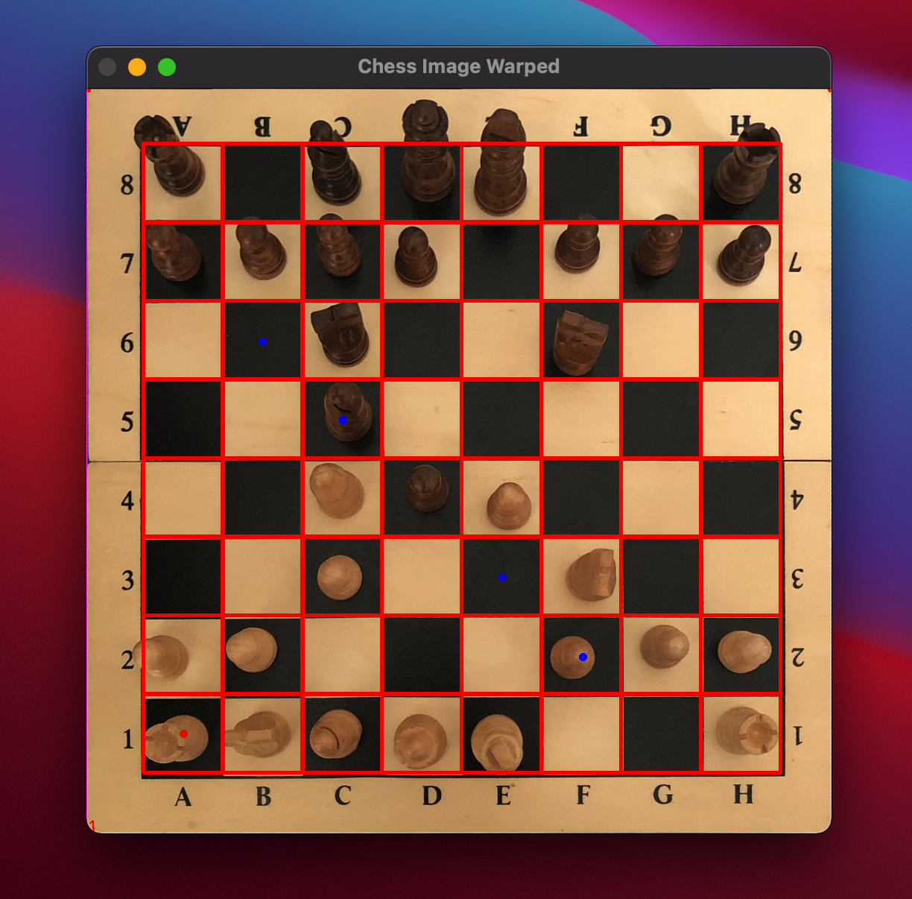
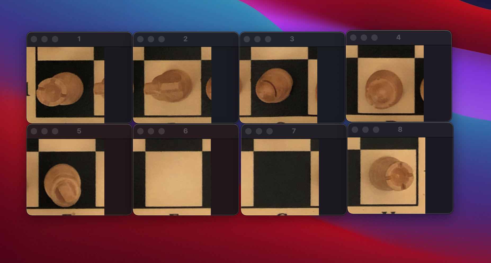

# ChessViewer

This is my current sparetime C++ project. My motivation can be summarized in three points:
* Enjoyment of learning new skills
* Gaining more practical experience in Computer Vision using OpenCV 
* Gaining more practical experience in Object Detection using CNNs (Caffe & Tensorflow)

The idea is to create a chess board recognition app which detect the chess position, transposes it into a FEN file. 
The FEN file can then be fed into a chess engine to predict the best next move. 

## Description

Here is where I am at currently. The app utilizes the OpenCV framework to
* detect the chess board corners
* transform the image accordingly
* recognize all fields
* outputs cropped images of each field 

Now the next steps are:
* creating and training a proper CNN with a binary output: field empty or field not empty
* createing and training a proper CNN with a 12x1 vector output: P(awn), (K)N(ight), B(ishop), Q(ueen), K(ing) for white and black

It is a one person sparetime project in progress with a long way to go still. So please, don't judge the code too much. 
You can find cleaner code of mine in the other repositories. :) 

If you'd like to cooperate and change this project into a two people project, don't hesitate to contact me. 
Could end up in a lot of fun or even in a long-lasting friendship!

## C++ & OpenCV
The code is written in C++ entirely so far. It utilizes the OpenCV framework.

## Dependencies for Running Locally
* cmake >= 3.7
  * All OSes: [click here for installation instructions](https://cmake.org/install/)
* make >= 4.1 (Linux, Mac), 3.81 (Windows)
  * Linux: make is installed by default on most Linux distros
  * Mac: [install Xcode command line tools to get make](https://developer.apple.com/xcode/features/)
  * Windows: [Click here for installation instructions](http://gnuwin32.sourceforge.net/packages/make.htm)
* OpenCV: I followed this excellent tutorial [here](https://thecodinginterface.com/blog/opencv-cpp-vscode/) to set up OpenCV using Visual Studio Code.  

## Basic Build Instructions

1. Clone this repo.
2. Make a build directory in the top level directory: `mkdir build && cd build`
3. Compile: `cmake .. && make`
4. Run it: `./chess-viewer`
